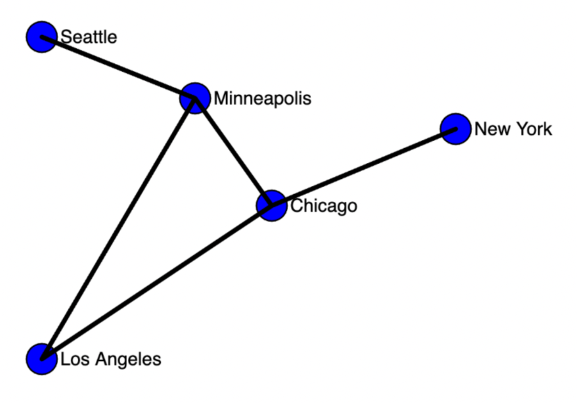
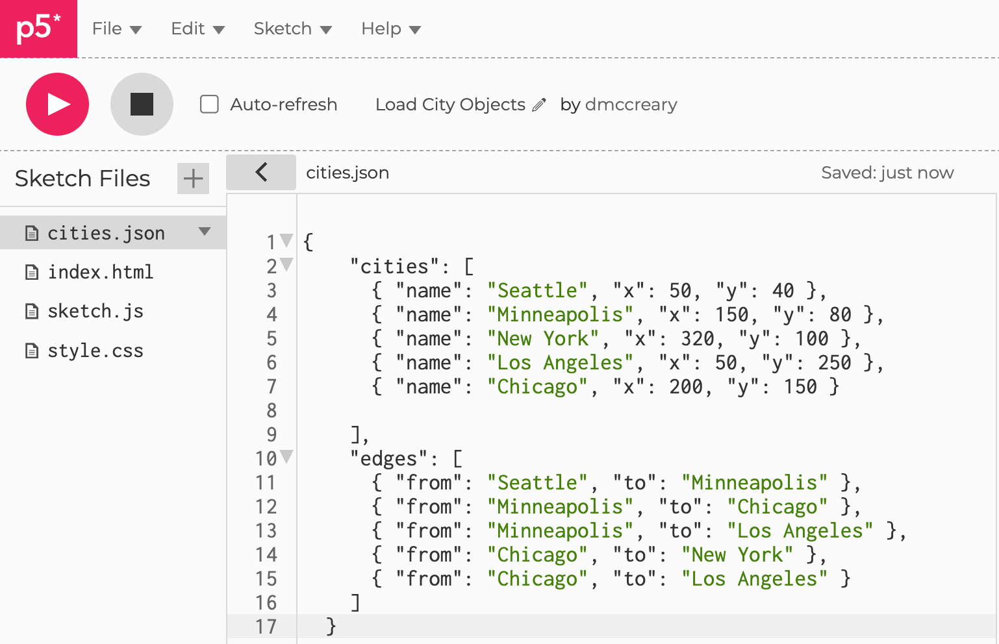

# Generating a JSON Data File



[Run the JSON file reader MicroSim](json.html){ .md-button .md-button--primary }
[Edit MicroSim](https://editor.p5js.org/dmccreary/sketches/ODXILDo8c)

## Sample prompt

```linenums="0"
Create a p5.js sketch that demonstrates loading a
list of vertices and edges from a JSON file.
The sketch uses a canvas of 400x400.
Create a sample JSON file that has a list of
the top largest metro areas in the US.
Position each city at a reasonable location
on the canvas and connect each city to three
other cities with edges.
```

## Sample JSON Data

You can click on the "Right Arrow" icon in the p5.js editor
to show the list of files in the p5.js application.
It will also allow you to edit the JSON file.



```json
{
  "cities": [
    { "name": "New York", "x": 350, "y": 100 },
    { "name": "Los Angeles", "x": 100, "y": 350 },
    { "name": "Chicago", "x": 200, "y": 150 },
    { "name": "Houston", "x": 150, "y": 250 },
    { "name": "Phoenix", "x": 80, "y": 120 }
    // Add more cities as needed
  ],
  "edges": [
    { "from": "New York", "to": "Los Angeles" },
    { "from": "New York", "to": "Chicago" },
    { "from": "Los Angeles", "to": "Houston" },
    { "from": "Chicago", "to": "Phoenix" }
    // Add more edges as needed
  ]
}
```

!!! Warning
    Always check the exact syntax when generative AI systems
    generate sample data.  They tend to add
    a trailing common to a list of items.  This
    is a syntax error and the JSON loader will not
    give you a clue where the error is.  Use a JSON
    syntax validator whenever possible.
## Sample p5.js Sketch

```js
// demo of loading graph data from a JSON file
let graphData;

function preload() {
  graphData = loadJSON('cities.json'); // Make sure to replace with your actual JSON file name
}

function setup() {
  createCanvas(400, 400);
  noLoop();
}

function draw() {
  background(255);

  // Check if the data is loaded
  if (graphData) {
    // Draw the cities
    fill(0);
    graphData.cities.forEach(city => {
      fill('blue');
      circle(city.x, city.y, 20);
      fill('black');
      text(city.name, city.x + 12, city.y + 4);
    });

    // Draw the edges
    stroke('black');
    strokeWeight(3);
    graphData.edges.forEach(edge => {
      let fromCity = graphData.cities.find(city => city.name === edge.from);
      let toCity = graphData.cities.find(city => city.name === edge.to);
      line(fromCity.x, fromCity.y, toCity.x, toCity.y);
    });
  } else {
    fill('black');
    text("Loading data...", 10, height / 2);
  }
}

// You can add additional functions or interactions here if needed

```
