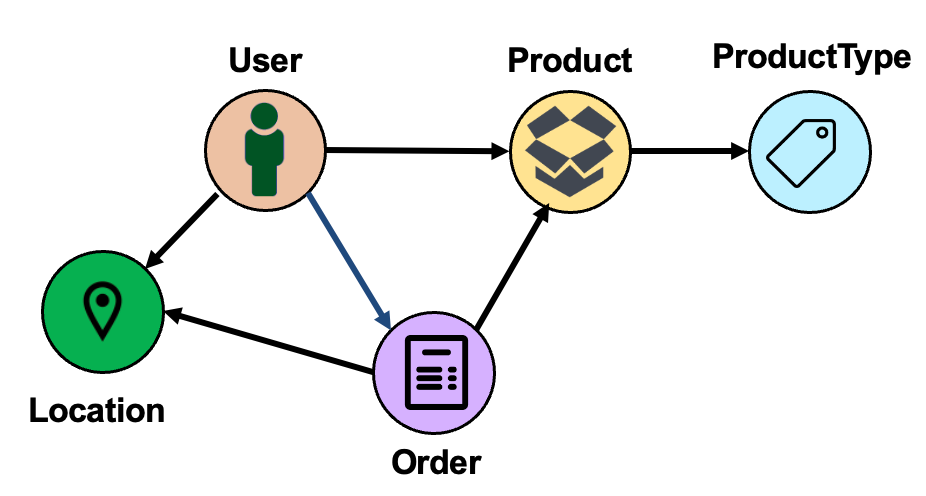

# Graph Terminology

In this course, we will be covering graph algorithms.  Before we dive into these algorithms we need to define some terms so we use them consistently in this course.

## What is a Graph?

A graph is a collection of nodes and edges.
The nodes usually represent nouns in our world (People, Places and Things) and the edges represent relationships between these things.

In our graph model, both nodes and edges can have properties associated with them.  This is called
a labeled property graph model or LPG.

The image above is a simple directional typed graph.
Each node has a type (User, Order, Product, Location, ProductType)
and each edge has a direction.  In the LPG
model edges have types, but for simplicity, the
edge types are not shown in this diagram.

## The LPG Model

The term "Labeled Property Graph Model" (LPG) refers to a specific type of graph database model that is primarily used for storing and managing complex networks of data. This model is characterized by the following key features:

1.  **Vertices (Nodes)**: These are the fundamental entities in the graph. Each vertex represents an object, such as a person, place, or thing. Vertices can have labels that denote their types or roles in the graph.

2.  **Edges (Relationships)**: Edges are the connections between vertices. They represent the relationships between entities. Like vertices, edges can also have labels that describe the nature or type of the relationship.

3.  **Properties**: Both vertices and edges can have properties, which are key-value pairs that store additional information about the entities or relationships. For example, a vertex representing a person might have properties like name, age, and email.

4.  **Direction**: The edges in a labeled property graph are directed. This means they have a start vertex and an end vertex, indicating the direction of the relationship.

5.  **Multiplicity**: The model allows for multiple relationships of the same or different types between a pair of vertices, providing a rich structure for representing complex networks.

The Labeled Property Graph Model is widely used in various applications such as social networks, recommendation systems, and fraud detection because of its flexibility and the rich, semi-structured nature of the data it can represent. It is particularly adept at handling interconnected data and complex queries involving deep relationships.

## Vertex or Node

A **vertex** (plural: vertices) is a fundamental data structure used in graph theory to represent an abstract concept of a point or a location within a graph. In simpler terms, a vertex is a node or a dot in the graph. Each vertex can have properties like a name, a value, or a color, but at its core, it serves as a basic entity that can be connected to other vertices.

In this course, we will represent vertices graphically with a
circle.  The circles will frequently have a label on them to indicate their type or their name.

### Usage of Vertices in Graphs:

1.  **Representation**: Vertices are used to represent entities or objects. For example, in a social network graph, each vertex could represent a person; in a city map graph, each vertex could represent an intersection.

2.  **Connections and Relationships**: Vertices are connected by edges. These edges represent the relationships or pathways between the vertices. For instance, in a road network graph, edges would represent roads connecting intersections (vertices).

3.  **Problem Solving**: In algorithmic graph theory, vertices are crucial in formulating and solving problems like pathfinding, network flow, or matching problems. Algorithms are designed to manipulate and traverse these vertices to find solutions.

4.  **Network Analysis**: Graphs are extensively used in network analysis, where vertices play a role in representing elements in networks such as computer, biological, or social networks. Analysis might focus on the relationships between these vertices, their centrality, or clustering within the graph.

5.  **Data Structuring**: In computer science, graphs are used to structure data. Vertices in these graphs can represent data points, and the connections (edges) can represent the relationship or interaction between these data points.

6.  **Visual Representation**: Vertices, along with edges, provide a visual way to represent complex systems or networks, making it easier to understand and analyze their structure and properties.

In summary, vertices are essential in graph theory for representing abstract or real-world entities and their interconnections in a wide array of applications ranging from social network analysis to algorithmic problem-solving.

## Edge, Relationship or Link

Edges are the way that we connect things in our graph.
In this course, every edge may have its own properties.
For example, if a graph represents cities, the
edges might contain a property such as "distance in miles" between each city pair.

We use the convention that relationships each have a type and this type is labeled with an all uppercase
name.

## Properties

Both nodes and edges have a list of properties associated with them.  These properties usually have a type such as a string, a decimal number or a date.

## Directionality

Edges may or may not have directionality in our graphs.
A distance edge between two cities may not have directionality, but a dependency graph which-says that task B depends on A finishing will have a direction.  We use arrows to indicate direction.