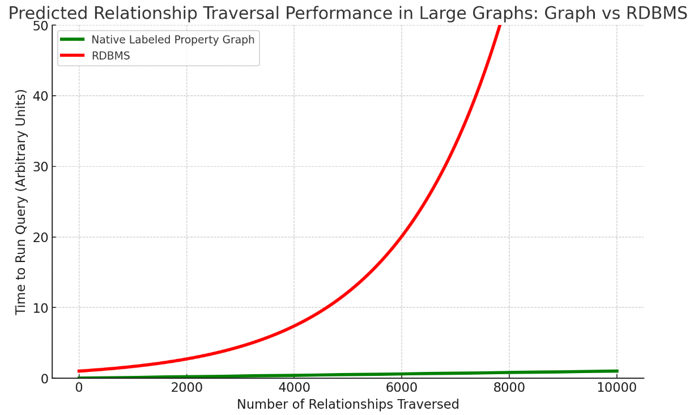

# Relationship Traversal

The chart illustrates the significant performance advantage that native graph databases typically have over RDBM systems in scenarios involving large and complex graph structures.  The chart provides a comparison of the predicted relationship traversal performance in a scenario with a very large graph, consisting of 1 billion vertices and 100 billion edges.

-   **Native Labeled Property Graph (Green Line):** Demonstrates a very slow linear growth in traversal time. This represents the high efficiency of graph databases in traversing relationships, benefiting from their optimized structure for direct pointer access and effective handling of large-scale graphs.

-   **RDBMS System (Red Line):** Shows an exponential growth in traversal time. This reflects the significant performance impact of JOIN operations in RDBMS systems, especially as the number of relationships increases. In large and complex datasets, such as the one described, the cost of these operations grows rapidly, leading to much slower performance compared to graph databases.

This chart is a conceptual representation to highlight the potential performance differences in handling large-scale graph data between native graph databases and traditional RDBMS systems. The actual performance can vary depending on the specific database architecture, indexing strategies, and query optimizations used. ​

