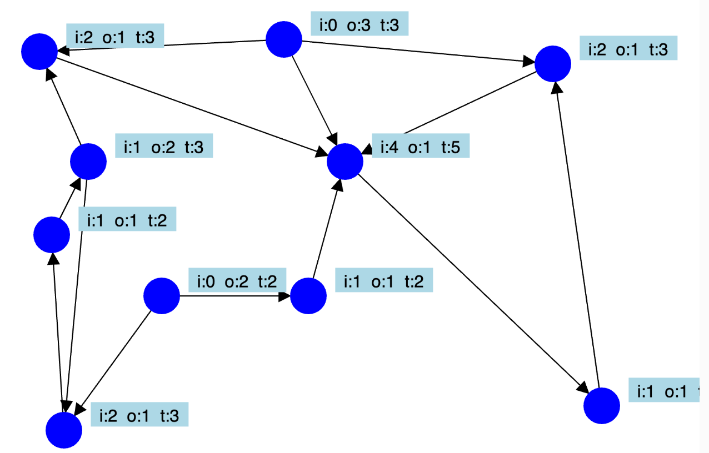

# Degree MicroSim

{ width="400" }

[Link to Demo](./degree.html){ .md-button .md-button--primary }
[Edit MicroSim](https://editor.p5js.org/dmccreary/sketches/ZBjxPNa6f)

The figure above is a simple graph that
has nodes represented by dark blue circles.

Next to each vertex is the "degree" of each node. There are three numbers:

1. **Incoming** The number of directed edges that
are entering the node.

2. **Outgoing** The number of directed edges that
are leaving the node or pointing at other nodes.

3: **Total** The sum of the incoming and outgoing edges.

Many graph databases don't perform well when a
graph has a large number of incoming or outgoing
edges.  For example, if you have a node for 
Gender (Female, Male or Unknown) then every
Person in the graph (billions?) would have
an incoming HAS_GENDER edge.  Although this
can work quickly to narrow down a population
to only female or male people, it can also
slow down your system if it was not designed
to scale.

In graph theory and network analysis, a vertex (or node) with a high number of incoming edges is often referred to as a "hub". This term is especially common in the context of scale-free networks, where some nodes act as highly connected hubs.

Another term that might be used, depending on the context, is "sink". This is particularly used in directed graphs where edges have a direction. In such cases, a sink is a vertex with a high number of incoming edges and few or no outgoing edges.

The importance of these nodes can vary depending on the specific application or the type of network being analyzed. For instance, in social network analysis, such nodes might represent influential individuals or organizations, whereas in web graph analysis, they might represent popular web pages with many incoming links.

## Celebrity Nodes: High In-Degree In Social Networks

In Twitter and other social media contexts, a person with a large number of followers is often referred to as an "influencer". This term is used because such individuals have the potential to influence their many followers through their posts, opinions, and endorsements.

Another common term is "Twitter celebrity" or "social media celebrity", used for individuals who have gained a significant following due to their fame on these platforms. This can include celebrities from other fields who have carried their fame over to social media, as well as people who have become famous primarily through their online presence.

In the context of network analysis, these individuals might be referred to as "nodes with high degree centrality", indicating that they have a high number of connections (followers in this case) within the network.