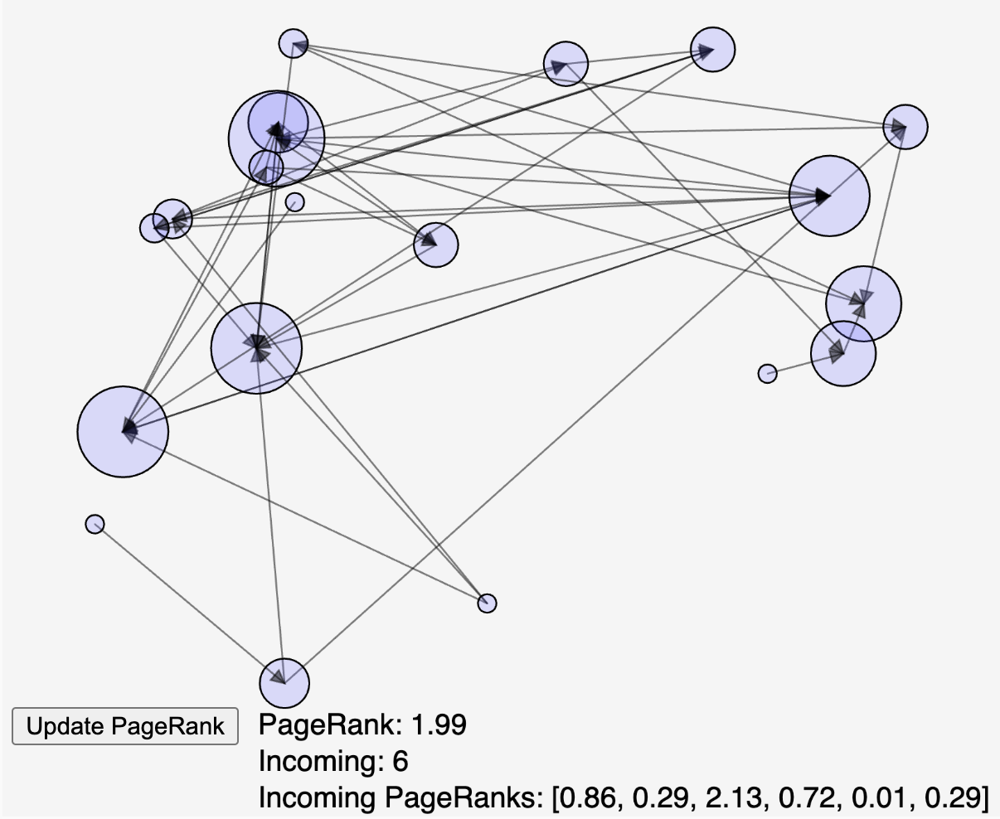

# Page Rank

<figure markdown>
   { width="400" }
   <figcaption>Figure caption.</figcaption>
</figure>

[Run the Page Rank MicroSim](./page-rank.html){ .md-button .md-button--primary }
[Edit the PageRank MicroSim](https://editor.p5js.org/dmccreary/sketches/YAwpC4f9I)

When the "Update PageRank" button is pressed multiple times in the p5.js sketch, the PageRank values for each node in the graph are recalculated and updated iteratively. Here's a breakdown of what happens during each update:

1.  **Initial PageRank Distribution**: Initially, every node is assigned the same PageRank value, typically `1.0`. This represents an equal distribution of 'importance' or 'rank' among all nodes.

2.  **PageRank Calculation**: On each update, the PageRank for each node is recalculated based on the PageRank algorithm. The new PageRank of a node is determined by the sum of the PageRank values of its incoming links, divided by the number of outgoing links from each of those nodes. This is modified by the damping factor, which is a constant (typically set around 0.85) used to model the probability of randomly jumping to another node in the network.

3.  **Damping Factor**: The damping factor (0.85 in your case) plays a critical role. It accounts for the likelihood that a person randomly clicking on links will eventually stop clicking. The damping factor is applied to the sum of PageRank values passed from neighboring nodes. The remaining part `(1 - damping factor) / number of nodes` is added to each node's score to ensure that the total PageRank in the system remains constant.

4.  **Iterative Updates**: Each time "Update PageRank" is pressed, the PageRank values are recalculated using the values from the previous iteration. With each iteration, the PageRank values gradually converge to a stable state where they don't change much with further iterations. This stable state reflects the relative 'importance' of each node within the network.

5.  **Visual Representation**: In the sketch, the diameter of each node is proportional to its PageRank value, so pressing the button repeatedly will adjust the sizes of the nodes to reflect their updated ranks.

6.  **Convergence**: After a sufficient number of iterations, the PageRank values will converge, meaning that additional iterations won't significantly change the values. The number of iterations needed for convergence depends on the structure of the graph and the damping factor.

In summary, each press of the "Update PageRank" button refines the estimation of each node's importance within the graph, moving the system closer to a balanced state where the PageRank values accurately represent the significance of each node based on its connections.

## Directed Edges Example

In this updated sketch:

-   Each `Node` now has two arrays: `outgoing` and `incoming`, representing outgoing and incoming links respectively.
-   The `addLink` method in the `Node` class creates a directed edge from one node to another.
-   The `drawEdges` method in the `Node` class calls the `drawArrow` function to visually represent the directed edges.
-   The `drawArrow` function is responsible for drawing an arrow from one node to another, indicating the direction of the link.
-   The `connectRandomly` method in the `Graph` class creates directed edges between nodes, simulating hyperlinks between web pages.

By pressing the "Update PageRank" button, the PageRank values are recalculated based on these directed edges, visually depicting the influence of each web page in the network.