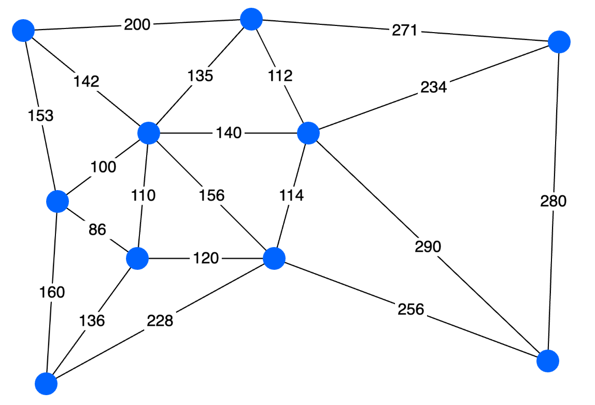

# Weighted Graph


{ width="400" }


[Link to Demo](./weighted-graph.html){ .md-button .md-button--primary }
[Edit](https://editor.p5js.org/dmccreary/sketches/ssrtXzl5_)

## Create a list of nodes and place them on the canvas

## Sample Prompt

```linenums="0"
Create a list of the 10 large major metropolitan cities
in the US and place them on a 400x400 canvas.
Round each point to the nearest integer.
Then create a p5.js sketch that will connect each
city to the nearest three cities.
Draw a graph that places the distance between
the nodes at the halfway point between the nodes.
```

```py
// weighted graph example
// I used ChatGPT to generate sample cities and moved them around
let cities = {
  "New York":      {x: 520, y: 40},
  "Los Angeles":   {x: 50,  y:180},
  "Chicago":       {x: 290, y:120},
  "Phoenix":       {x: 150, y:310},
  "Miami":         {x: 510, y:340},
  "San Diego":     {x: 70,  y:330},
  "Dallas":        {x: 270, y:290},
  "Seattle":       {x: 50,  y: 30},
  "Minneapolis":   {x: 250, y: 40},
  "San Francisco": {x: 160, y:150}
};

function setup() {
  const canvas = createCanvas(550, 440);
  var mainElement = document.querySelector('main');
  canvas.parent(mainElement);
  textSize(14);
  calculateNeighbors();
}

function draw() {
  background(255);
  
  for (let city in cities) {
    // draw lines to nearest three cities
    for (let neighbor of cities[city].neighbors) {
      let neighborX = cities[neighbor].x;
      let neighborY = cities[neighbor].y;
      stroke(0);
      // need to put the line in
      line(cities[city].x, cities[city].y, neighborX, neighborY);
      // put the distance text at midpoint
      let midX = (cities[city].x + neighborX) / 2;
      let midY = (cities[city].y + neighborY) / 2;
      // calculate the distance
      let distance = dist(cities[city].x, cities[city].y, neighborX, neighborY);
      // place a white box behind weight
      noStroke();
      fill('white');
      rect(midX-14, midY-8, 28, 16);
      // draw the text in black and align it
      fill('black');
      textAlign(CENTER,CENTER);
      // nf is number format with 0 decimal places
      text(nf(distance, 0, 0), midX, midY);
    }
  }
  for (let city in cities) {
    fill(0,100,255);
    circle(cities[city].x, cities[city].y, 20);
  }
  
  noLoop(); // Static drawing
}

function calculateNeighbors() {
  for (let city in cities) {
    let distances = [];
    for (let otherCity in cities) {
      if (otherCity !== city) {
        let d = dist(cities[city].x, cities[city].y, cities[otherCity].x, cities[otherCity].y);
        distances.push({ city: otherCity, distance: d });
      }
    }
    distances.sort((a, b) => a.distance - b.distance);
    cities[city].neighbors = distances.slice(0, 3).map(d => d.city);
  }

}

```


